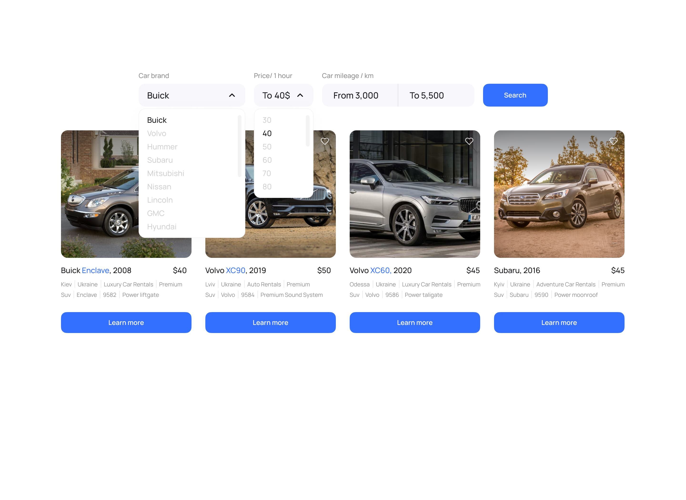
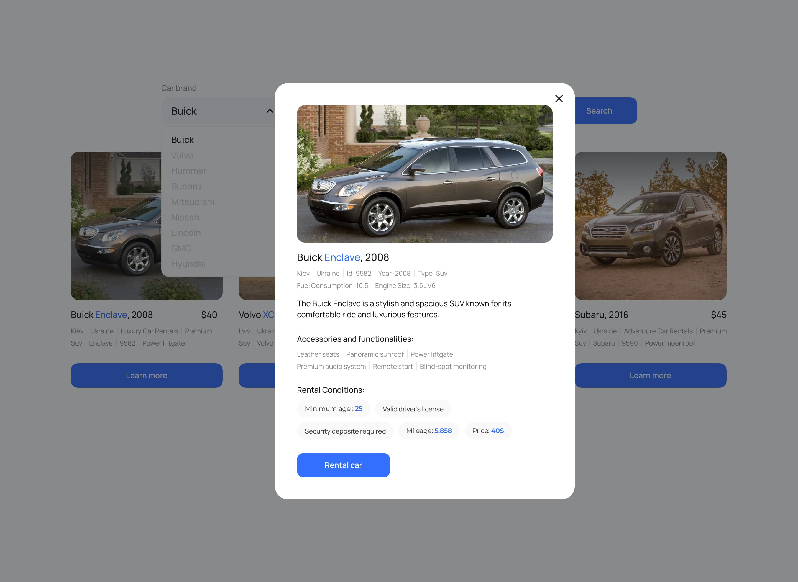

# Тестове завдання

## Опис

Створено застосунок для компанії, що надає послуги надання в Україні автомобілів
в оренду. Застосунок складається з 3х сторінок:

- домашня сторінка з загальним описом послуг, що надає компанія.
- сторінка, що містить каталог автівок різної комплектації, які користувач може
  фільтрувати за маркою, ціною за годину оренди авто та кількістю кілометрів,
  яку подолав автомобіль під час його експлуатації (пробіг).
- сторінка з оголошеннями, які були додані користувачем в улюблені.

    

## Реалізація технічної частини

1. Відповідно до
   [макету](https://www.figma.com/file/XhC8FSCfAkraEF5l7Hx4fL/Test?type=design&node-id=0-1&mode=design&t=Ed3b0heFOmE2LSXU-0)
   реалізовано картку оголошення про здачу авто в оренду.
2. На першій сторінці каталогу рендеритися 8 оголошень, а їх решта - по кліку на
   кнопку `Load more`.
3. У разі кліку по кнопці у вигляді “серця” на картці оголошення воно додається
   до списку улюблених, а колір кнопки змінюватися.
4. При оновленні сторінки фіксується кінцевий результат дій користувача. Тобто,
   якщо додати оголошення в улюблені та оновити сторінку - то кнопка все одно
   залишається в стані “улюбленого оголошення” із відповідним кольором.
5. У разі повторного кліку по кнопці у вигляді “серця” оголошення видаляється зі
   списку улюблених, а колір кнопки змінюється до початкового стану.
6. У разі кліку по кнопці Learn more відкривається модальне вікно з детальною
   інформацією про авто та умови його оренди.
7. Модальне вікно закривається по кліку на кнопку у вигляді “хрестика”, по кліку
   на `backdrop` або натисканню на клавішу `Esc`.
8. Кнопку `Rental car` реалізована як посилання, що надає можливість користувачу
   зʼєднатись з компанією за номером телефону +380730000000.

Створено маршрутизацію, використовуючи `React Router`. У застосунку є такі
маршрути:

- `“/”` - домашня сторінка з загальним описом послуг, що надає компанія
- `“/catalog”` - сторінка, що містить каталог автівок різної комплектації
- `“/favorites”` - сторінка з оголошеннями, які були додані користувачем в
  улюблені Якщо користувач зайшов за маршрутом, якого не існує, його
  перенаправляє на домашню сторінку. Для роботи зі списком оголошень створено
  свій персональний бекенд для розробки за допомогою UI-сервісу
  https://mockapi.io/. Створено ресурс adverts.

Advert

1. Створено `advert` в **Mockapi** з наступними полями: `id`, `year`, `make`,
   `model`, `type`, `img`, `description`, `fuelConsumption`, `engineSize`,
   `accessories`, `functionalities`, `rentalPrice`, `rentalCompany`, `address`,
   `rentalConditions`, `mileage` (див. скріншот нижче). Для наповнення колекції
   взяли
   [adverts.json](https://drive.google.com/file/d/1sDtZQX4awbRiqa5mSagngqKBZeMMRUMO/view)
   
2. Зображення авто підібрані самостійно.
3. В базі є від 32 оголошень з різними значеннями. Реалізована пагінація, де
   одна сторінка пагінації вміщає 8 оголошень.

## Додаткове завдання

Додано фільтрацію:

1. `dropdown` із марками автомобіля
   [makes.json](https://drive.google.com/file/d/1ywi6jdoqq0llsd2yDcRKwuLhuL3ds_5z/view) -
   показано оголошення з автівками відповідної марки
2. `dropdown` із цінами за годину оренди авто (крок 10$) - показано оголошення з
   автівками, ціна за оренду яких належить до діапазону цін, обраних
   користувачем
3. група `input` для визначення діапазону пробігу, в межах якого користувач
   шукатиме оголошення
